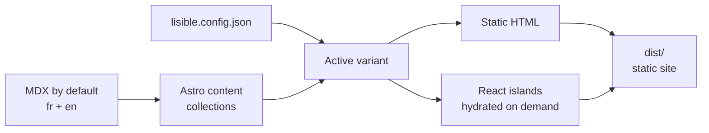
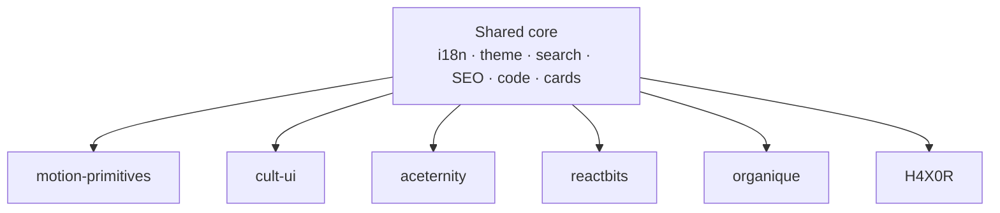

<div align="center">


One audited core, six visual variants. Bilingual, dark by default, fast, SEO-ready, accessible. You pick the look in a config file; everything else is already done.

<p>


</p>

<p>
<a href="https://vercel.com/new/clone?repository-url=https%3A%2F%2Fgithub.com%2Fdidntchooseaname%2Flisible"></a>
<a href="https://app.netlify.com/start/deploy?repository=https%3A%2F%2Fgithub.com%2Fdidntchooseaname%2Flisible"></a>
</p>

[Documentation](https://lisible.xsec.fr) · [Quick start](#quick-start) · [Deployment](#deployment) · [Variants](#variants) · [Configuration](#configuration) · [Features](#features) · [License](#license)

</div>

---

## Variants

Six skins over the exact same core. Same features, same content, same theme tokens: only the experience changes.

| Variant | Feel |
| --- | --- |
| **motion-primitives** | Swiss minimalism, typographic micro-interactions |
| **cult-ui** | Editorial, gradient headings, textured controls |
| **aceternity** | Spotlight, bento grid, tracing beam |
| **reactbits** | Dense animated components, pill nav |
| **organique** | Draggable node constellation, live link states, floating dock |
| **H4X0R** | Immersive terminal HUD, interactive background |

Do not pick from a table: browse the variants live in the [documentation previewer](https://lisible.xsec.fr), or locally with `bun run preview:all`, which builds and serves all six side by side.

## Quick start

Lisible uses [Bun](https://bun.sh) for its tooling, so Bun needs to be installed. It is fast and recommended. Once it is present you can drive the project with npm, pnpm or bun, whichever you prefer.

**Install Bun**

```bash
# macOS / Linux
curl -fsSL https://bun.sh/install | bash

# Windows (PowerShell)
powershell -c "irm bun.sh/bun/install.ps1 | iex"

# or, if you already have Node
npm install -g bun
```

**Get the code**

Pick the path that matches what you are doing:

1. **Starting your own blog (recommended): use the template.** Click ["Use this template"](https://github.com/didntchooseaname/lisible/generate) on GitHub. You get your own repository, with a clean history and no ties to this one, then:

   ```bash
   git clone <your-repository-url> my-blog
   cd my-blog
   ```

2. **Starting without a GitHub repository: degit.** Copies the files without any git history:

   ```bash
   bunx degit didntchooseaname/lisible my-blog
   cd my-blog
   git init
   ```

3. **Contributing to Lisible itself: clone.** Keep the full history and rename the remote so your own repository can become `origin` later:

   ```bash
   git clone https://github.com/didntchooseaname/lisible
   cd lisible
   git remote rename origin upstream
   ```

Then run the guided setup. It walks you through the variant, site title and URL, then either stops there (quick mode) or lets you fine-tune author, accent color and repository (detailed mode). Everything is written to `lisible.config.json`; non-interactive setups can pass flags instead: `bun run init --yes --variant organique --title "My blog"`.

No manual install step is required. `init` installs the selected variant automatically. You can also run `preview:all` immediately on a fresh clone, before or after `init`; it installs and rebuilds all six variants before starting their preview servers.

<details open>
<summary><b>bun</b> (recommended)</summary>

```bash
bun run init          # guided setup + automatic dependency installation
bun run dev           # start the dev server
bun run build         # build the static site (the variant's dist/)
bun run preview       # serve the build locally
bun run variant       # print the active variant
bun run preview:all   # install, build and compare every variant (ports 43211-43216)
```

</details>

<details>
<summary><b>npm</b></summary>

```bash
npm run init          # guided setup + automatic dependency installation
npm run dev           # start the dev server
npm run build         # build the static site (the variant's dist/)
npm run preview       # serve the build locally
npm run variant       # print the active variant
npm run preview:all   # install, build and compare every variant (ports 43211-43216)
```

</details>

<details>
<summary><b>pnpm</b></summary>

```bash
pnpm run init         # guided setup + automatic dependency installation
pnpm run dev          # start the dev server
pnpm run build        # build the static site (the variant's dist/)
pnpm run preview      # serve the build locally
pnpm run variant      # print the active variant
pnpm run preview:all  # install, build and compare every variant (ports 43211-43216)
```

</details>

Prefer to configure by hand? Skip the wizard, set `variant` in `lisible.config.json`, and run `dev`.

## Deployment

Import the repository at its root and deploy: every configuration builds the variant selected in `lisible.config.json` (override it with a `LISIBLE_VARIANT` environment variable on the platform) and publishes the mirrored `dist/` directory.

- Vercel and Netlify are configured by `vercel.json` and `netlify.toml`.
- Railpack auto-detects `railpack.json` and `Staticfile`; Nixpacks auto-detects `nixpacks.toml`.
- The platform-provided `PORT` is used automatically.
- The runtime tools are version-pinned; Nixpacks also checksum-verifies every downloaded Node, Bun and Caddy artifact.
- Only the compiled site and its Caddy runtime are copied into the final image.

The generated image serves static routes directly, compresses responses, caches fingerprinted Astro assets for one year, and renders the project 404 page for unknown routes. No deployment environment variable is required.

## How it works

Your content lives once. Astro renders it to static HTML and hydrates only the interactive pieces (islands). The variant chosen in the config decides the skin.


```mermaid
flowchart LR
  MD["MDX by default<br/>fr + en"] --> AC["Astro content<br/>collections"]
  CFG["lisible.config.json"] --> SEL["Active variant"]
  AC --> SEL
  SEL --> HTML["Static HTML"]
  SEL --> ISL["React islands<br/>hydrated on demand"]
  HTML --> OUT["dist/<br/>static site"]
  ISL --> OUT
```

The six variants are skins over a single shared core, so a fix or a feature lands everywhere the same way.


```mermaid
flowchart TD
  CORE["Shared core<br/>i18n · theme · search · SEO · code · cards"]
  CORE --> V1["motion-primitives"]
  CORE --> V2["cult-ui"]
  CORE --> V3["aceternity"]
  CORE --> V4["reactbits"]
  CORE --> V5["organique"]
  CORE --> V6["H4X0R"]
```

## Configuration

### Choose a variant

The active variant is the single choice you make, in `lisible.config.json`:

```json
{
  "variant": "organique"
}
```

Valid values: `motion-primitives`, `cult-ui`, `aceternity`, `reactbits`, `organique`, `h4x0r`. Not sure which one? Run `bun run preview:all` and compare them in the browser.

### Everything else

`lisible.config.json` is the whole user configuration: identity, social links, feature flags and integrations, all optional with sensible defaults. The JSON schema referenced by `$schema` documents every field and powers editor autocompletion:

```json
{
  "$schema": "./docs/lisible.config.schema.json",
  "variant": "organique",
  "site": {
    "title": "My blog",
    "url": "https://blog.example.com",
    "author": "Ada Lovelace",
    "accent": "#22C55E"
  },
  "social": { "github": "https://github.com/you" },
  "features": { "comments": false, "portfolio": { "friends": false } },
  "repo": { "url": "https://github.com/you/your-blog" }
}
```

Interface strings and taglines stay beside each theme in `src/i18n/`, with French and English side by side.

Fresh clones render local discussion placeholders on every article. Configure `integrations`, enable the `comments` and/or `webmentions` flags, then disable `demoPlaceholders` when connecting real providers.

## Features

Everything below is built in and shared by all six variants.

**Reading**
- Full-text search (Pagefind), <kbd>Ctrl</kbd>/<kbd>Cmd</kbd> + <kbd>K</kbd>
- Table of contents with scroll spy, reading time, prev/next, reading progress
- Full-screen image viewer with zoom and pan
- Callouts, KaTeX math, Mermaid and draw.io diagrams that re-render with the theme
- Rich code blocks (Expressive Code): titled editor and terminal frames, line and word markers, collapsible sections, copy button
- GitHub repository cards and OpenGraph link previews from the content

**Theme**
- Dark by default (true black), light (pure white), no flash on load
- Animated theme toggle (circular reveal), state preserved across navigation
- Reader-customizable accent color, contrast guaranteed in both modes

**International and SEO**
- Native FR/EN routing (`/` and `/en/`), translated content, hreflang, per-locale RSS
- Per-post OpenGraph images, JSON-LD, sitemap, robots.txt, `llms.txt`
- No full page reloads: view transitions with hover prefetch

**Authoring**
- `bun run new-post` scaffolding, drafts hidden in production
- Covers, pinned posts and tags; Archives in the top navbar; Series shown there only when published series content exists
- Link checking and asset budgets in the build

**Accessibility**
- Full keyboard navigation, visible focus, AA contrast, reduced motion respected

## Create a post in 30 seconds

The fastest way is the scaffolder. It creates the file in the shared content source with valid frontmatter, in the right language, ready to edit:

```bash
bun run new-post my-first-post            # French MDX post (default)
bun run new-post my-first-post --locale en # English post
bun run new-post my-first-post --translate # create both fr and en at once
bun run new-post my-first-post --markdown  # opt into plain Markdown
```

Then open the generated `.mdx` file under `shared/content/blog/`, write your content, and set `draft: false` when you are ready. MDX is the global default: it supports all regular Markdown plus the shared `Tabs`, `Steps` and `Spoiler` components. Every variant reads that same file, so it appears on the home page, the blog list, the search index and the RSS feed automatically.

Prefer to do it by hand? Create a `.mdx` file under `shared/content/blog/fr/` (or `en/`) with this frontmatter:

```yaml
---
title: "My post"
description: "In one sentence, what it is about."
pubDate: 2026-07-18
updatedDate: 2026-07-18   # optional
tags: ["astro", "performance"]
cover: "/images/cover.jpg" # optional
draft: false
---
```

A file with the same name in `fr/` and `en/` links the two translations. Drafts (`draft: true`) are visible in development and hidden in production. The `demo-fonctionnalites.mdx` post is the canonical, bilingual integration reference: it renders Markdown, rich directives, diagrams, footnotes, `Tabs`, `Steps` and `Spoiler` in every variant.

## Project structure

```text
lisible/
├─ lisible.config.json     # the whole user configuration (variant, identity, flags)
├─ package.json            # global commands
├─ scripts/                # runner, scaffolder, previews and checks
├─ shared/
│  ├─ config.ts            # reads and validates lisible.config.json
│  ├─ site.config.ts       # identity derived from the configuration
│  ├─ features.ts          # feature flags derived from the configuration
│  ├─ variants.ts          # variant catalog and preview ports
│  ├─ content/
│  │  ├─ collection.ts     # frontmatter and portfolio data schemas
│  │  ├─ taxonomy.ts       # bilingual tag aliases
│  │  ├─ blog/fr/          # only source for French articles
│  │  ├─ blog/en/          # only source for English articles
│  │  ├─ portfolio/        # certifications and friends data
│  │  └─ public-images/    # shared article assets
│  ├─ routes/              # identical locale, blog, tag, RSS and robots routes
│  ├─ markdown/            # shared Markdown pipeline helpers
│  └─ public/              # common favicon, KaTeX and fallback OG asset
├─ docs/previews/          # screenshots consumed by the documentation site
└─ versions/
   ├─ _core/               # reference implementation
   ├─ motion-primitives/   # visual implementation and thin adapters
   ├─ cult-ui/
   ├─ aceternity/
   ├─ reactbits/
   ├─ organique/
   └─ h4x0r/
```

The rule is deliberate: content and behavior that must change everywhere belong in `shared/`; theme components, styles and theme-specific copy stay in `versions/<variant>/`. Shared source files are linked into the locations Astro expects, so there is still only one file to edit.

## Credits and licenses

Lisible itself is released under the MIT License, see [LICENSE](LICENSE).

It stands on the work of others. Each dependency keeps its own license; the terms below are the ones published by each project at the time of writing, always defer to the upstream license.

**UI component kits.** Components are adapted and copied into each variant per each kit's license.

| Kit | Link | License |
| --- | --- | --- |
| motion-primitives | https://motion-primitives.com | MIT |
| cult/ui | https://www.cult-ui.com | MIT |
| Aceternity UI | https://ui.aceternity.com | MIT (free components) |
| ReactBits | https://reactbits.dev | MIT |
| Magic UI | https://magicui.design | MIT |

**Core libraries.** [Astro](https://astro.build), [Tailwind CSS](https://tailwindcss.com), [Expressive Code](https://expressive-code.com), [Pagefind](https://pagefind.app), [Motion](https://motion.dev), [GSAP](https://gsap.com), [Lucide](https://lucide.dev), [KaTeX](https://katex.org) and [Mermaid](https://mermaid.js.org), each under its own license (MIT for most, OFL or Apache for some). Package manager: [Bun](https://bun.sh).

**Fonts.** Inter, JetBrains Mono and Orbitron, served through [Fontsource](https://fontsource.org), all under the SIL Open Font License.

Trademarks and brand names belong to their respective owners; linking to them here is attribution, not endorsement.
